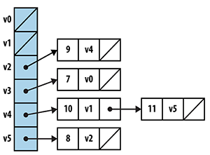
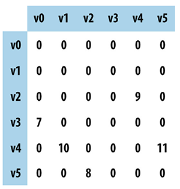

## Graph

A graph representation can be summed up with this equation: G = (V, E)

Where V is a set of vertices, and E is a set of edges - linking the vertices together and represents the relationship between vertices.

For example, if a student is a member of a class, student and class are 2 vertices, linked together by the relationship member - which is the edge of student and class.

## Types of graphs

### 1. Undirected, unweighted graph

Relationships between vertices (u, v) have no regards for direction and weight. Usefult to capture a social network for example. If Alice is a friend of Bob, then Bob is a friend of Alice.

### 2. Directed graph

The relationship between (u, v) is distinct from the relationship between (v, u). For example, John is Doe's student while Doe is John's teacher.

### 3. Weighted graph

There is a numerical value that goes along with the relationship between vertices (u, v). Sometimes, the value can be non-numerical. For example, the distance between town A and B can be denoted with integers ranging from 1 - 1000 or just simply 'high', 'medium', 'low'.

## Storing a directed weighted graph

A directed weighted graph can be stored as an Adjacgency List or an Adjacgency Matrix.

### Example: 

Considering this directed weighted graph:


Store graph as adjacency list:



Store graph as adjacgency matrix:



## Graph algorithms

### 1. Depth-First Search

Depth first search utilizes a recursive visit function that tracks down all the child vertices of u, of which u is the neighbour of starting vertice s. Depth first search use color markers white (unvisited), gray (processing - visisted, but have child vertices that are yet to be visited), black(visited) to mark the visit state of each vertice to prevent double visit.

Step summary (quote from source):

```
depthFirstSearch(G, s)
    foreach v in V do:
        pred[v] = -1
        color[v] = White # *1
    dfsVisit[s]
end

dfsVisit(u)
    color[u] = Gray
    foreach neighbour v of u do
        if color[v] = White then # *2
            pred[v] = u
            dfsVisit(v)
    color[u] = Black # *3
end

# *1: Initially mark all vertices in the graph as WHITE.
# *2: Find unvisited neighbour and head in that direction.
# *3: Once all neighbours are visited, that direction is done

```


#### Context

- Depth first search (DFS) does not guarentee path found is shortest.
- DFS requires O(n) overhead for storing color marker for each vertex.
- Processing information is stored separately from the graph, makes DFS suitable for processing complex graph, since dfsVisit uses the original Graph as read-only data structure.

### 2. Breadth-First Search

Unlike depth-first search, breadth-first search does not visit all child vertices of neighbour u at once, but rather visit all neighbours u that are k distance away from v before visiting neighbours who are k + 1 distance away. 

In another word, depth-first search travels like a snake - going down each path 1 by 1, while breadth-first search travels like waves, spreading across the closest neighbours at once before traveling further.

Due to this behaviour, breadth-first search always find the shortest path from starting vertex s to target vertex t.

```
# Best, Average, Worst: O(V+E)

breadthFirstSearch(G, s)
    foreach v in V do
        pred[v] = -1
        dist[v] = ∞
        color[v] = White # *1
    color[s] = Gray
    dist[s] = 0
    Q = empty Queue # *2
    enqueue(Q, s)
    
    while Q is NOT empty do
        u = head(Q)
        foreach neighbour v of u do
            if color[v] = White then
                dist[v] = dist[u] + 1
                pred[v] = u
                color[v] = Gray
                enqueue(Q, v)
        dequeue(Q)
        color[u] = Black # *3
end

# *1: Initially all veritices are marked as not visisted.
# *2: Queue maintains collection of gray nodes that are visisted.
# *3: Once all neighbours are visisted, this vertex is done.
```
