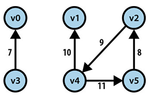

## Graph

A graph representation can be summed up with this equation: G = (V, E)

Where V is a set of vertices, and E is a set of edges - linking the vertices together and represents the relationship between vertices.

For example, if a student is a member of a class, student and class are 2 vertices, linked together by the relationship member - which is the edge of student and class.

## Types of graphs

### 1. Undirected, unweighted graph

Relationships between vertices (u, v) have no regards for direction and weight. Usefult to capture a social network for example. If Alice is a friend of Bob, then Bob is a friend of Alice.

### 2. Directed graph

The relationship between (u, v) is distinct from the relationship between (v, u). For example, John is Doe's student while Doe is John's teacher.

### 3. Weighted graph

There is a numerical value that goes along with the relationship between vertices (u, v). Sometimes, the value can be non-numerical. For example, the distance between town A and B can be denoted with integers ranging from 1 - 1000 or just simply 'high', 'medium', 'low'.

## Storing a directed weighted graph

A directed weighted graph can be stored as an Adjacgency List or an Adjacgency Matrix.

### Example: 

Considering this directed weighted graph:

Store graph as adjacgency list:

Store graph as adjacgency matrix:

